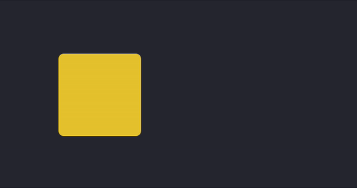

## CPSC 410 DSL Project - Submission - Animation and Motion Graphics Tool

### Group 13
Al Parillon  
Andrew Liu  
Andrew Zulaybar  
Nanda Syahrasyad  
Nick Birtch  

Please see the provided documentation and examples in Documentation.md

Our project is deployed at https://pedantic-banach-259c1c.netlify.app/


--- 

## CPSC 410 DSL Project - Milestone 4 - Animation and Motion Graphics Tool

### Group 13
Al Parillon  
Andrew Liu  
Andrew Zulaybar  
Nanda Syahrasyad  
Nick Birtch  

### **Updated Grammar**
**Program** ::= "define:" Persistence+ "main:" Statement+

**Statement** ::= Persistence | Deletion | AnimationOrchestration | Wait | Collisions | Condition | Looping  

---
  
**Entity** ::= "object" | "animation" | "layer"

**Identifier** ::= [A-Za-z0-9]+

**AnimationIdentifier**::=  Identifier <*Must be an existing identifier created using Create Animation **Identifier***>

**ObjectIdentifier** ::= Identifier <*Must be an existing identifier created using Create Object **Identifier**>*

**LayerIdentifier** ::= Identifier <*Must be an existing identifier created using Create Layer **Identifier**>*  

---

**Persistence** ::= ("create" | "update") (AnimationDescriptors | ObjectDescriptors | LayerDescriptors)

**Deletion** ::= "delete" Entity Identifier  

---

<*Note: Parameters that are specified a second time (e.g. two values for `fill`) will have no effect>*

**AnimationDescriptors** ::= "animation" Identifier ":" AnimationParameter*

**LayerDescriptors** ::= "layer" Identifier ":" LayerParameter*

**ObjectDescriptors** ::= "object" Identifier ":" ObjectParameter*  

---

<Note: Following lists of Parameters are **not** exhaustive currently>

**AnimationParameter** ::= "velocity:" FloatingPoint | "duration:" Time | "direction:" Direction |  "scale:" Integer

**ObjectParameter** ::= "shape:" Shape ("fill:" Colour | "x:" Integer | "y:" Integer | "opacity:" Opacity)*

**Shape** ::= "circle" CircleParameters | "rectangle" RectangleParameters | "polygon" PolygonParameters

**CircleParameters** ::= "radius:" Integer

**RectangleParameters** ::= "width:" Integer | "height:" Integer

**PolygonParameters** ::= "points:" "(" Coordinate+ ")"

**LayerParameter** ::= "position:" Integer | "objects: [" ObjectIdentifier+ "]" 

<Note: If objects are in multiple layers, most recently applied animation → layer should take precedence>   

---  

<Note: Certain ObjectParameters like fill, opacity can be extended as AnimationParameters for additional dynamic elements>

**AnimationOrchestration** ::= AnimationAction PerformAnimation

**AnimationAction** ::= "start" | "stop" | "speedUp" | "slowDown" | "reset"

**PerformAnimation** ::= AnimationIdentifier (ObjectIdentifier | LayerIdentifier)?

*<Note: Using actions on animations that have not been created and started will have no visible effect>*  

---

<*Note: Following lists of Parameters are **not** exhaustive currently*>
**Direction** ::= "up" | "down" | "right" | "left" | 2DVector

**Time (in seconds)**::= [0-9]+

**FloatingPoint** ::= [-|+]?[0-9]*\.?[0-9]+

**Integer** ::= [-|+]?[0-9]+

**2DVector** ::= Coordinate 

**Coordinate** ::= "(" Integer "," Integer ")"

**Colour** ::= [A-Za-z]* | [0-9]{6,} | "blue" | "red" | "green" | ...

**Opacity** ::= 1(\.0)? | (0\.?[0-9]*)   

--- 

**Wait** ::= "wait" Time

**Collisions** ::= "collisions" ("on" | "off")  

---
  
**Condition** ::= "if" X OP Y "(" Statement+ ")"

**OP**::= "<" | ">" | "<=" | ">=" | "==" | "!="

**X/Y** ::= Entity Identifier "." Parameter | String | Number

---

**Looping**::= "loop" LoopingParameters "(" Statement+ ")"

**LoopingParameters**::= "count" Integer | "if" X OP Y

---


### **Status**
- First User Study completed (See Milestone 3 for details and resulting changes)
- Grammar EBNF completed and revised
- Documentation started and improving (examples, grammar, feature list, parameters list)
- Boiler Plate, code structure, language design discussed and completed
- Tokenizer/Parser nearing completion
- UI Design nearing completion
 
### **Final User Study**

- Find new participants
- Finish supporting documentation
- Plan for video

---

- Perform User Testing
    - **Give them the example code snippets you prepared; answer any question**
    - **Give them your description of your task**
    - **Ask them to "think aloud" while they are working**

- Interpret User Reactions
    - **Reflect carefully on the outcomes of your user study**
    - **Did your users provide suggestions? Don't necessarily take them!**
    - **Identify instead where your users got confused - look at how that relates to design principles - what principle was being violated that caused their confusion?**
    - **Was their confusions show-stopping? Were they able to complete the task?**
    - **What errors did they make? Was anything awkward for them to express?**
    
    
### TA Feedback:  
 - Make the dynamic programming features more clear
     - Will continue to extend supporting documentation before final user study, open to introducing new dynamic features if viable
 - After doing user studies, we may get negative feedback or criticism about DSL which would be insightful to include in video
     - Going forward with plan to show in video how we have addressed the takeaways from user studies
 - Anything in lecture + material of the course important to implement ourselves; but using external libraries to produce output is fine
     - Going forward with external Framer Motion library for our animations

### Schedule: 
- Milestone 4 - Oct 9th
- Validator, Evaluator - Oct 12th
- Proof of Concept Build (UI, Tokenizer, Parser, Validator, Evaluator)  - Oct 12th

---

- Final User Study - Oct 13th
- MVP Build - Oct 17th
- Presentation Video - Oct 17th
- Documentation - Oct 18th
- Project - Oct 19th, 9am

---
---
---


## CPSC 410 DSL Project - Milestone 3 - Animation and Motion Graphics Tool

### Group 13
Al Parillon  
Andrew Liu  
Andrew Zulaybar  
Nanda Syahrasyad  
Nick Birtch  

### Mockup of Language Design

**Identifier**::= String

**Entity**::= "Object" | "Animation" | "Layer" | "Global" 

**Keyword**::= "Create" | "Delete" | "Update"

**AnimationKeyword**::= Identifier <*Must be an existing animation identifier created using Create Animation **Identifier***>

**GlobalKeyword**::=  "Start" | "Stop" | "SpeedUp" | "SlowDown" | "Collision"

---

**Execution**::= (( Keyword Entity | AnimationKeyword ) Identifier | GlobalKeyword) Parameter*

**Parameter**::=  AnimationParameter | ObjectParameter | GlobalParameter

<*Note: Following lists of Parameters are **not** exhaustive*>

**AnimationParameter**::=  "Velocity" Number | "Duration" Time | Direction ("up" | "left" | "down" | "right" | 2DVector) | etc.

**ObjectParameter**::=  "Shape" ("circle" | "square" | "triangle" | etc.) | "Colour" ("blue" | "red" | "green" | etc.) | "Width" Number | "Height" Number | etc.

**GlobalParameter**::=  "Modifier" Number | "Duration" Time | "At" Time | "On" ("true" | "false") | etc.

---

**Condition**::= "if" X OP Y "(" Execution+ ")"

**X/Y**::= Identifier Parameter | String | Number

**OP**::=  "<" | ">" | "<=" | ">=" | "=" | "!="

**Looping**::=  "Loop" LoopingParameters "(" Execution+ ")"

**LoopingParameters**::= "Count" Number | "(" Time "," Time ")" | "if" X OP Y

**Time**::= Number <*in seconds, Domain: 0 - arbitrary limit*>

---

## First User Study

- Perform User Testing
    - **Give them the example code snippets you prepared; answer any question**
        - Went through the code snippet and explained how to create objects and animations
        - Explained what each thing means
        - Asked how to customize size of the object (Ex. how to alter width and length of a rectangle)
    - **Give them your description of your task**
        - I told her what the project was about, why we were doing it, and our design of the language
    - **Ask them to "think aloud" while they are working**
        - Does not understand the different types of units: em, px, and % means relating to size
        - Velocity was not part of features and requirements and didn't know the units behind velocity
        - Thought that requirements and features were ambiguous and was not self explanatory for people with no technical background
        - Would love the excel function where after typing in a function, excel shows what’s needed to fulfill that function in nontechnical terms
        - Found that my question was ambiguous so she just followed along the example given
        - Wasn’t sure if she needed to tab or if it was just for formatting purposes
        - She would not have been able to do it without the example to refer to
        - Main function was very confusing and did not understand how to run her animations
        - Unsure if to put animation or object first, or if both could work (Ex. Triangle moveLeft or moveLeft triangle)
        - Does not understand global and if condition, and why they’re there

- Interpret User Reactions
    - **Reflect carefully on the outcomes of your user study**
        - The list of features and requirements was not straight forward and needs adjustments and expansion for clarity
    - **Did your users provide suggestions? Don't necessarily take them!**
        - The user suggested an autocomplete feature similar to excel where it displays what should go into a function
    - **Identify instead where your users got confused - look at how that relates to design principles - what principle was being violated that caused their confusion?**
        - The design principles that we need to continue working on are Simplicity, Regularity, and Security.
    - **Was their confusions show-stopping? Were they able to complete the task?**
        - They were able to complete the task, but unsure if it was the correct format and had to ask a lot of questions while doing it, etc.
    - **What errors did they make? Was Anything awkward for them to express?**
        - The user needed the combination of examples and the features and requirements doc to successfully do the example. Also, there is ambiguity in units such as PositionX and PositionY. The max of those requirements is not identified. She did not know how many px would constitute the right side.

    Ex) I asked the user to make a blue triangle and make it move left starting from the right side (This task is quite ambiguous and just trying to see if she can figure the language out)

    ```yaml
    User study #1:
    define:
    	create animation moveleft:
    		velocity: 5
    		duration: 10s 
    		direction: left
    	
    	create object triangle:
    		shape: triangle
    		color: blue 
    		x: 100
    		y: 0
    		size: 30

    main:
    	moveleft triangle 

    ```

### Changes from User Study
 - Grammar isn't helpful for non-technical persons 
   - Decide on default units, clarify domain, document so users have access to useful reference material
   - Rewrite grammar to be more learnable/usable for first time users, less structure variation in basic elements like Execution
 - Take out as many unit symbols (s, px, %, etc.) in parameters as possible so user can just type a number, rely on documentation
 - Continue to expand and simplify documentation and supporting examples

### Current Progress:  
 - First User Study is complete
 - Mockup of Language Design is complete   
 - Coding boilerplate/architecture/style, team logistics and schedule have been finalized  
 - Development is under way on animation proof of concepts, tokenizer and parser  
 

### TA Feedback:  
 - Highest priority is language design
 - Example documentation: One example for each feature, keep simple, can prompt examples with an example problem/use case
 - Object Collision: Can just check if two objects collide and have a default rule or result, dynamic element is challenging
    - Using a global collision option, can toggle on/off for collision functionality

### Follow-up Work:  
 - Proof of Concept Build - Oct 9th
 - Expand and finalize first iteration of feature list, parameter list, documentation

---
---
---

## CPSC 410 DSL Project - Milestone 2 - Animation and Motion Graphics Tool

### Group 13
Al Parillon  
Andrew Liu  
Andrew Zulaybar  
Nanda Syahrasyad  
Nick Birtch  

### Division of Responsibilities:  
Front End = UI, Animations, Proof of Concepts, Evaluator  
Back End = Grammar, Tokenizer, Parser, Validator  
Shared = Internal Representation, Extended Features, Milestones, Project Video  

Al Parillon - Front End, Evaluator  
Andrew Liu - Front End/Back End, Validator  
Andrew Zulaybar - Back End, Parser, Validator  
Nanda Syahrasyad - Front End (lead), Evaluator  
Nick Birtch - Back End (lead), Grammar, Tokenizer, Parser  

Week to week, team members may swap teams if Front End or Back End is deemed more critical to work on.  


### Roadmap: 
 - Milestone 2 - Sept 25th  
 - Mockup Concrete Language Design (Grammar) and User Study - Sept 29th  
 - Milestone 3 - Oct 2nd  
 - Basic Tokenizer, Parser - Oct 4th  
 - Basic UI, Animation functionality - Oct 4th  
 - Basic Validator, Evaluator - Oct 9th  
 - Proof of Concept Build - Oct 9th  
 - Milestone 4 - Oct 9th  
 - Final User Study - Oct 12th  
 - MVP Build - Oct 14th  
 - Presentation Video - Oct 17th  
 - Project due Oct 19th  

### Current Progress:  
 - We've established a weekly meeting time (group and TA), divided responsibilties and created our Roadmap  
 - Discussed initial plan for design architechture, coding styles, technologies  
 - Expanding on initial concept grammar and developing internal representation  
 - Began investigating animation concepts and feature feasibility  
 

### TA Feedback:  
 - There are a lot of features, some of which are not clearly defined yet  
   - Discuss and refine feature concepts, document  
   - Create language mockup to be able to contextualize features, discuss w/ TA which features our DSL might need  
 - Continue to keep organized, develop schedule to build understanding of project scope and timelines   
 - Start with clearly defined feature sets, expand as time permits  
 - Don't use high-level goals, further specify and define subtasks and assign subtasks to people  

### Follow-up Work:  
 - Discuss and refine feature concepts, document  
 - Create language mockup to be able to contextualize features  
 - Begin brunt of development work on Tokenizer/Parser  

---
---
---

## CPSC 410 DSL Project - Milestone 1 - Animation and Motion Graphics Tool

### Group 13
Al Parillon  
Andrew Liu  
Andrew Zulaybar  
Nanda Syahrasyad  
Nick Birtch  

### Description
Our DSL project is an animation and motion graphics tool that allows the user to create a variety of 2d objects and perform animations on them. The user will input using a simplified code grammar and be able to generate visual media products with a novice level of coding experience. We will be fleshing out our tool with dynamic properties such as collision cases, looping animations, animation timings and object layering. Our goal is that the user can develop their programming abilities while expressing themselves creatively.

### Programmable Dynamic Elements: 
- Creation of 2D Shapes/Objects 
   - Rectangle Shapes (rectangle, square, parallel, rhombus)
   - Triangle Shape
   - Circle Shapes (circle, oval)
   - Polygon Shapes (trapezoid, pentagon, hexagon, octogon, etc.)
   - Images [LOCAL SRC or WEB SRC]
   - Lines (straight-line, curved-line)
   - Defined with optional features (height, width, angle, positioning, color, border, transperancy, etc.)
- Looping, Animation Timings 
  - Time Start/Time End (relative (to parent), absolute (to global)) 
  - 2D animations
  - Defined with optional features (repeat-for, repeat-every)
- Creation of Text Objects and Animations
  - Font, Size, Warp, Color, 2D animations
- 2D Animations
  - Expansion/Reduction
  - Vector Movement
  - Rotate, flip, reverse
  - Visibility
  - Attribute change
  - Origin (return-after-loop)
- Global Actions 
  - Time dilation (modifier to animation timings)
  - Focus (capture-location, zoom-by, pan-by)
- Collision Cases 
  - Change properties
  - Perform or override an animation
  - Overlap (ov-previous, ov-next)
  - Combine (aggregate, aggregate-by)
  - Visibility
- Object Layering (groups of objects) 
  - Nesting Layers
  - Animating Layers 
  - Default attribute settings

### Extended Feature Ideas:
- Sandbox View 
  - Ability to see your animations as you code them
- Consecutive Animations
  - Ability to have shapes move in different directions within the same output
  - Ex. A red square that moves up and down the middle of the screen and then moves right after 20 seconds
- Interactive Animations
   - Ability to execute animations and object creation on command
   - Ex. Pressing a key creates a Black Square that expands from the center of the screen
- Play and Pause Feature
  - Ability to press pause on animations then continue after pressing play
  - Ex. Pink square moving right until pause button is pressed, then starts moving right again after play button is pressed
- Morph Objects During Animation
   - Ability to change shape features (color, size, shape, etc) during animation
   - Ex. Black triangle becomes a big green circle after 10 seconds
- Export Animations
   - Ability to export user created animations as a .gif

### Is it justified to use a DSL?:

##### Users: 
- Novice Programmers
- Designers, marketers, presenters  

##### Use Cases:
- Education tool used as introduction to programming paradigms with a focus on visual media 
   - Easy to visualize, develops user's understanding of programming and has a resulting personal product
- Ability to create low fi design mockups and presentations that requires minimal background programming experience to use.
   - Allows users to convey their ideas, provides ease of access to a visual medium

### Input:
- Basic english interpretation of object creation
- Animations can be defined separately and applied to object names  
- Collision cases/Global Actions defined separately and applied to object names (or Global)
  
### Output:
- On execution, generate animations in execution window  

##### Example:

```
animation simple_translation {
  from: {
    x: 0
  },
  to: {
    x: 100
  }
}

object square my_square {
  width: 50,
  height: 50,
  background: yellow
}

main {
  simple_translation(my_square)
  delay 100
  reverse simple_translation(my_square)
}
```

<p align="center">
  
</p>

### TA Feedback:

- Potential user concerns:
  - The specific type of user is important to keep in mind (e.g. Should we focus on a certain demographic and provide relevant types of animations for them?)
  - We should flesh out the capabilities of our DSL; we want to be able to provide our users with the ability to generate dynamic, interesting animations.
  - Is the problem domain large enough to provide programmable freedom?

- Language features:
  - There are interesting use cases (e.g. collision of objects, camera angles etc.), but we could keep thinking of more features to make the language more dynamic.
  - Users should be able to programmatically control the movement of objects and control the speed of objects.
  - Users should be able to define and manage a list of layers. For example, a good use case would be creating a background and adding layers that sit on top of the background. All layers could have animations occurring simultaneously.
  - We should continue to think about adding as many features as we can! This project has a lot of potential in terms of its use cases and applications.

- Technical details:
  - How are we going to represent the input? Would the parser need to understand images as input?
  - Implementation issues may arise when we start working on mapping the input to the output, so it's good to consider this sooner rather than later.

- Other comments:
  - Compared to our other idea, this idea allows us to focus on building the language instead of grappling with external tools to support our language idea. Therefore, we have more time to focus on building the DSL itself.

### Follow-up Work:
 - Milestone 2 - Dividing main responsibilities amongst team
 - Milestone 2 - Creating project schedule
 - Determine feasibility of interactive animations, real time animation generation.
 - Prioritize feature necessity (1 - Critical, 2 - High, etc.)


